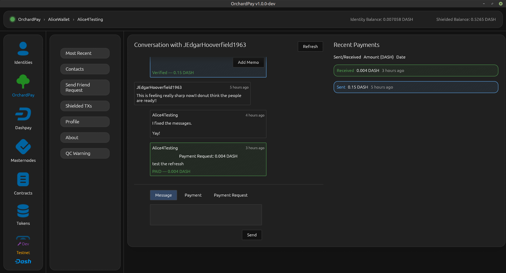
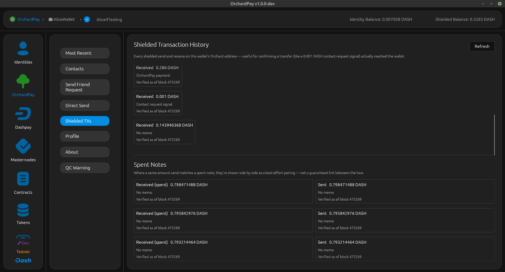
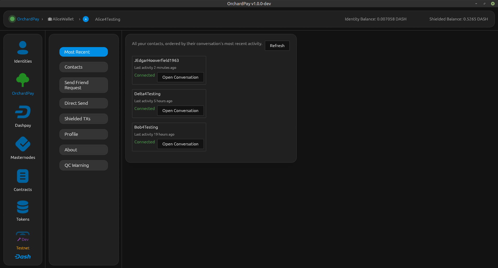

# OrchardPay

**OrchardPay** is a Rust desktop GUI application (fork of DET) for interacting with [Dash Platform](https://www.dash.org/). It adds a privacy-preserving contact, messaging, and payment dapp — shielded, with no public, queryable record of who is connected to whom.

See the [user documentation](https://docs.dash.org/en/stable/docs/user/network/orchardpay/) for setup and usage instructions.

| | | |
|---|---|---|
|  |  |  |

## Features

**Private Contacts, Messaging & Payments (OrchardPay)**
- Publish a shielded address so others can find and connect with you — unlike a public contact-request document, nothing about it reveals your social graph
- Establish contacts through a shielded, two-way handshake: no on-chain document ever links two identities together
- Exchange encrypted messages, payment requests, and real shielded payments with your contacts
- Send DASH directly to anyone with a published shielded address by DPNS search, with or without bundling a contact request
- Recover your contacts from the network alone, with no local backup needed
- Currently available on Testnet only — the OrchardPay contract isn't registered on Mainnet or Devnet yet

**Identity**
- Register, load, and manage Platform identities
- Top up identity credits from wallet UTXOs, asset locks, or Platform addresses
- Add authentication, voting, owner, and transfer keys
- Withdraw or transfer credits between identities

**DPNS**
- Register usernames
- View and vote on contested name auctions
- Schedule votes for future execution

**Wallet**
- Import wallets from mnemonic seed phrases or single private keys
- Send payments to Core addresses (single or batch)
- Create and recover asset locks for identity funding

**Tokens**
- Register, mint, burn, and transfer fungible tokens
- Freeze/unfreeze tokens, pause/resume transfers, destroy frozen funds
- Configure direct purchase pricing and claim distribution rewards

**DashPay**
- Manage your profile (display name, bio, avatar)
- Send and accept contact requests
- Send payments to contacts

**Documents & Contracts**
- Fetch, register, and update data contracts
- Create, query, replace, delete, transfer, and purchase documents

**Tools**
- Decode and inspect state transitions
- Visualize Grovedb proofs and documents
- View platform information and masternode quorum details
- Check Core address balances

## Programmatic Access (MCP)

- [MCP Server](docs/MCP.md) — expose wallet and core operations via Model Context Protocol (HTTP or stdio)
- [CLI Client](docs/CLI.md) — command-line tool to call MCP operations from scripts and terminals

## Getting prebuilt binaries

For now, only a Linux Flatpak build is published (see below). Download it from the Releases page (TODO: link once the repo is public). Windows and macOS builds aren't currently published — see [Building from source](#building-from-source) to run OrchardPay on those platforms today.

### Install via Flatpak (Linux)

The easiest way to run OrchardPay on Linux is via Flatpak. Download the `.flatpak` bundle for your architecture from the latest release (TODO: link once the repo is public) and install it:

``` shell
# x86_64
flatpak install orchardpay-linux-x86_64.flatpak

# aarch64 (ARM)
flatpak install orchardpay-linux-aarch64.flatpak
```

To run:

``` shell
flatpak run org.orchardpay.OrchardPay
```

To uninstall:

``` shell
flatpak uninstall org.orchardpay.OrchardPay
```

The Flatpak version runs in SPV (light client) mode — no full Dash Core node is required. Application data is stored in `~/.var/app/org.orchardpay.OrchardPay/config/orchardpay/`.

> **Note:** The Flatpak data path differs from native Linux builds, which use `~/.config/orchardpay/`.

### Windows runtime dependencies

If you build and run OrchardPay on Windows, make sure the target machine has:

- Microsoft Visual C++ Redistributable (vc_redist x64): https://aka.ms/vc14/vc_redist.x64.exe
- OpenGL 2.0 support. If OpenGL 2.0 is not available (or the app fails to start with OpenGL-related errors), install the OpenCL, OpenGL, and Vulkan Compatibility Pack:
  https://apps.microsoft.com/detail/9nqpsl29bfff?ocid=webpdpshare

## Building from source

See the [Contributing Guide](CONTRIBUTING.md) for prerequisites, build instructions, and development workflow.

## Application directory

When the application runs for the first time, it creates an application directory and stores an `.env` file in it (based on [`.env.example`](.env.example)). It also stores application data in the directory. If you need to update the `.env` file, locate it in the application directory for your operating system:

| Operating System | Application Directory Path |
| - | - |
| macOS | `~/Library/Application Support/OrchardPay/` |
| Windows | `C:\Users\<User>\AppData\Roaming\OrchardPay\config` |
| Linux | `/home/<user>/.config/orchardpay/` |

## Environment Variables

| Variable | Values | Default | Description |
| - | - | - | - |
| `ORCHARDPAY_ACCESSIBILITY` | `1` / unset | unset | Force-enable accessibility support. Activates AccessKit eagerly so the UI element tree is populated every frame and (on macOS) forces the platform accessibility adapter to initialize. Without this flag, accessibility still works normally — VoiceOver and other assistive technologies trigger AccessKit's lazy activation automatically. This flag is needed for tools that query the accessibility tree without registering as assistive technology clients (e.g. AXUIElement-based automation like Peekaboo). |

The interface mode (Default view / Detailed view / Developer tools) is not an
environment variable — it is chosen in the app and stored with your settings.
See [docs/user-roles.md](docs/user-roles.md), which also covers the obsolete
`DEVELOPER_MODE` entry older configurations may still contain.

## Contributing

Contributions are welcome! See the [Contributing Guide](CONTRIBUTING.md) for details.

## License

This project is licensed under the MIT License. See the [LICENSE](LICENSE.md) file for details.

## Support

- **Issues**: Open an issue on GitHub Issues (TODO: link once the repo is public).
- **Community**: Join the Dash community forums or Discord server for discussions.

## Security Note

Keep your private keys and identity information secure. Do not share them with untrusted parties or applications.
