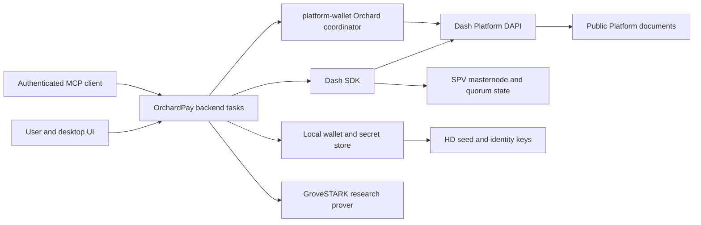

# OrchardPay comprehensive security and zero-knowledge review

Review date: 2026-07-25  
Repository: [orchardpaytl/orchardpay](https://github.com/orchardpaytl/orchardpay)  
Reviewed branch: `v1.0-dev`  
Reviewed commit: [`aa70924d8bbe6b5504b70ae077e0579c0a0a4635`](https://github.com/orchardpaytl/orchardpay/commit/aa70924d8bbe6b5504b70ae077e0579c0a0a4635)  
Application version: `1.0.0-dev`

## Executive assessment

OrchardPay is a serious engineering effort with unusually good internal documentation, careful secret-lifetime handling, exact upstream Git revision pins, full Simplified Payment Verification (SPV), and a large automated test suite. The application does not implement the Orchard zero-knowledge proving system itself. It delegates Orchard wallet coordination and proof generation to the pinned `dashpay/platform` codebase. It also delegates Dash Platform proof verification to the Dash Software Development Kit (SDK) and a quorum-aware SPV context provider.

The application is not ready for production funds.

The main release blocker is a sender-binding failure in OrchardPay encrypted messaging. Thread queries select documents by a shared reference identifier but do not authenticate the Platform document owner. The decoder then assigns direction from the query bucket instead of from the signed document owner. This creates two attack classes.

- A contact can publish arbitrary valid ciphertext that the victim’s client labels as the victim’s own message.
- Any observer can copy a public ciphertext into a new document with the same reference identifier. The victim’s client will decrypt and display the replay because the original authenticated encryption bytes remain valid.

This is not an Advanced Encryption Standard Galois/Counter Mode (AES-GCM) failure. It is a protocol composition failure. The platform supplies an authenticated owner identifier, but the application discards it at the point where sender identity is decided.

A separate high-severity release-pipeline issue executes a mutable third-party GitHub Action from `@main` while giving it secrets, pull-request write access, and OpenID Connect (OIDC) token authority.

No critical finding was confirmed. Two high, eight medium, and four low findings are documented below.

| Severity | Count | Release meaning |
|---|---:|---|
| Critical | 0 | No confirmed immediate universal theft or proof-forgery path |
| High | 2 | Must fix before production or a trusted public beta |
| Medium | 8 | Must resolve or formally constrain before production funds |
| Low | 4 | Hardening and governance work |

## Scope and method

The review used a clean sparse checkout of the public repository. Every finding was revalidated at the commit named above. The review covered:

- OrchardPay contact establishment, encrypted messages, payments, receipts, recovery, and memo scanning
- Orchard shielded wallet integration and the local proof-verification trust boundary
- GroveSTARK proof generation and verification, including the pinned upstream revision
- Hierarchical deterministic (HD) key derivation, secret storage, signing, and memory handling
- Model Context Protocol (MCP) server authentication and fund-moving tools
- GitHub Actions, release provenance, test coverage, and dependency advisories
- Privacy claims and recovery claims

The review did not perform:

- A mathematical audit of the Orchard circuit, Halo 2 implementation, or Dash Platform consensus code
- A complete line-by-line audit of the pinned `dashpay/platform` repository
- A live adversarial test against the deployed Testnet contract
- Dynamic memory instrumentation, fuzzing, or binary reverse engineering
- A historical secret scan across all 1,018 commits

The local environment did not include Rust or Cargo. Compilation and test evidence therefore comes from GitHub Actions at the exact reviewed commit. The current test run passed. The current Clippy run compiled and linted successfully but the workflow was marked failed after the lint step because its reporting action lacked permission.

## Architecture and trust boundaries

The security model depends on five distinct mechanisms.

1. Dash Platform authenticates each document owner and returns a proof-backed document.
2. OrchardPay encrypts contact and message payloads under static Elliptic Curve Diffie-Hellman (ECDH) secrets.
3. The upstream Orchard wallet creates and verifies shielded state transitions.
4. SPV supplies quorum and masternode data needed to verify Platform proofs.
5. Local wallet seeds and identity keys authorize funds and Platform state transitions.

The high-severity messaging flaw occurs between mechanisms one and two. Ciphertext authentication succeeds, but document-owner authentication is not joined to it.

## Prioritized findings

### H-01 Encrypted threads do not bind ciphertext to the signed document owner

Severity: High  
Confidence: High  
Affected property: Message authenticity, transcript integrity, payment-record integrity, availability

The checked-in contract provides two message indexes. One is keyed by `refId` and creation time. The other is keyed by owner and creation time. It does not provide a combined owner, reference, and creation-time index.

[`contract_schema.json` lines 73-109](https://github.com/orchardpaytl/orchardpay/blob/aa70924d8bbe6b5504b70ae077e0579c0a0a4635/src/backend_task/orchardpay/contract_schema.json#L73-L109)

The thread fetch queries only `refId`.

[`messages.rs` lines 903-931](https://github.com/orchardpaytl/orchardpay/blob/aa70924d8bbe6b5504b70ae077e0579c0a0a4635/src/backend_task/orchardpay/messages.rs#L903-L931)

The decoder decrypts `msgData` and accepts the caller-supplied `from_me` Boolean. It never checks `document.owner_id()`.

[`messages.rs` lines 1107-1156](https://github.com/orchardpaytl/orchardpay/blob/aa70924d8bbe6b5504b70ae077e0579c0a0a4635/src/backend_task/orchardpay/messages.rs#L1107-L1156)

`load_thread` fetches two reference buckets and labels every document in one bucket as sent by the local identity and every document in the other as sent by the counterparty.

[`messages.rs` lines 1159-1232](https://github.com/orchardpaytl/orchardpay/blob/aa70924d8bbe6b5504b70ae077e0579c0a0a4635/src/backend_task/orchardpay/messages.rs#L1159-L1232)

The latest-activity query has the same omission. An unrelated owner can affect conversation ordering with a matching reference identifier.

[`messages.rs` lines 950-996](https://github.com/orchardpaytl/orchardpay/blob/aa70924d8bbe6b5504b70ae077e0579c0a0a4635/src/backend_task/orchardpay/messages.rs#L950-L996)

#### Exploitability

A counterparty knows the directional shared secret used to decrypt the victim’s outgoing messages. It can create new encrypted content using that key, publish the document under its own Platform identity, and set the victim’s reference identifier. The victim’s client decrypts the content and labels it `from_me = true`.

An outside observer has a weaker but still real replay capability. Platform message documents and their reference identifiers are public. An observer can copy a valid `msgData` value into a new Platform document with the same `refId`. AES-GCM still verifies because the bytes are unchanged. The new document gets a new identifier and timestamp, and the victim’s client accepts it because owner identity is ignored.

Consequences include:

- forged outgoing chat history
- replayed messages and payment requests
- duplicated or misleading payment and receipt records
- manipulated recent-activity ordering
- resource consumption and page-window displacement

The attacker cannot derive plaintext from AES-GCM without the relationship key. An outside replay attacker also cannot redirect a shielded payment to its own address through this defect alone. The client resolves the established contact’s shielded address separately. The flaw can still induce duplicate or misleading payment interactions and destroys transcript authenticity.

#### Required fix

1. Reject every thread document whose `owner_id()` is not the expected local or counterparty identity before decryption and before timestamp use.
2. Migrate the contract to add an index containing `$ownerId`, `refId`, and `$createdAt`. Query-side owner binding is needed to prevent an attacker from filling the first result page with wrong-owner documents.
3. Add a versioned message envelope. Derive separate keys with a standard key derivation function and bind the contract identifier, network, owner identifier, expected peer, reference identifier, message type, and protocol version as associated authenticated data.
4. Add adversarial tests for wrong-owner valid ciphertext, copied ciphertext with a new document identifier, wrong-owner latest activity, and page-window flooding.
5. Treat existing v1 transcripts as unauthenticated until each document has been reclassified by its signed Platform owner.

### H-02 A mutable third-party action receives secrets and OIDC authority

Severity: High  
Confidence: High  
Affected property: Source and release pipeline integrity, secret confidentiality

The pull-request review workflow executes `lklimek/claudius-review-action@main`. The same job grants issues and pull-request write access plus OIDC token issuance. It passes an OAuth token and a separate API key to the action.

[`claude-code-review.yml` lines 12-44](https://github.com/orchardpaytl/orchardpay/blob/aa70924d8bbe6b5504b70ae077e0579c0a0a4635/.github/workflows/claude-code-review.yml#L12-L44)

`@main` is a mutable ref. A change or compromise in the upstream action repository changes the code executed inside OrchardPay’s trusted workflow without an OrchardPay commit. That code can read the supplied secrets, request an OIDC token, and write to pull requests.

The release workflows also contain several tag-pinned actions instead of commit-pinned actions. The `@main` action is the clearest and highest-risk instance because of the credentials and permissions it receives.

#### Required fix

1. Pin every external action to a reviewed full commit hash.
2. Remove `id-token: write` from the review job unless the action has a documented and reviewed OIDC use.
3. Give the action only the permissions it needs.
4. Move high-value secrets out of third-party action inputs where possible.
5. Add Dependabot or Renovate for reviewed action-pin updates.
6. Require approval for any workflow change and any update to a pinned action commit.

### M-01 Thread and recovery queries silently stop at 100 documents

Severity: Medium  
Confidence: High  
Affected property: Availability, completeness, recovery

`fetch_messages_by_ref_id` says it fetches every message, and `fetch_own_anchors` says it fetches every anchor. Neither function sets a limit or paginates.

[`messages.rs` lines 903-931](https://github.com/orchardpaytl/orchardpay/blob/aa70924d8bbe6b5504b70ae077e0579c0a0a4635/src/backend_task/orchardpay/messages.rs#L903-L931)  
[`contact_anchor.rs` lines 895-919](https://github.com/orchardpaytl/orchardpay/blob/aa70924d8bbe6b5504b70ae077e0579c0a0a4635/src/backend_task/orchardpay/contact_anchor.rs#L895-L919)

At the pinned Dash Platform revision, an unset SDK limit falls back to `drive::config::DEFAULT_QUERY_LIMIT`. That value is 100, and the default maximum is also 100.

[`DocumentQuery` limit behavior at the pinned Platform commit](https://github.com/dashpay/platform/blob/288a6cae4f9653d6085d2b3d6c7410210a0c95ba/packages/rs-sdk/src/platform/documents/document_query.rs#L246-L267)  
[`DEFAULT_QUERY_LIMIT` at the pinned Platform commit](https://github.com/dashpay/platform/blob/288a6cae4f9653d6085d2b3d6c7410210a0c95ba/packages/rs-drive/src/config.rs#L12-L17)

A conversation becomes incomplete after the first 100 matching documents. Network recovery becomes incomplete after 100 owned anchors. The sender-binding flaw makes this more serious because wrong-owner documents can consume the result window.

#### Required fix

Implement deterministic pagination with `$createdAt` and document identifier tie-breaking. Put a total-item safety cap in the user interface, not in the protocol fetch. Test 99, 100, 101, 200, and same-timestamp cases.

### M-02 Multi-step contact and payment flows are not atomic

Severity: Medium  
Confidence: High  
Affected property: State consistency, payment-record integrity, user funds spent on fees

Contact initiation publishes a permanent `contactAnchor`, then sends the shielded signal transfer, then writes local state.

[`contact_anchor.rs` lines 107-288](https://github.com/orchardpaytl/orchardpay/blob/aa70924d8bbe6b5504b70ae077e0579c0a0a4635/src/backend_task/orchardpay/contact_anchor.rs#L107-L288)

If the transfer fails, the anchor remains public and the local relationship state is not recorded. A retry can create another anchor. Acceptance uses the same broad sequence.

Freeform payment sends publish a `Payment` document before the shielded transfer. Optional receipts are also published before the transfer.

[`messages.rs` lines 747-865](https://github.com/orchardpaytl/orchardpay/blob/aa70924d8bbe6b5504b70ae077e0579c0a0a4635/src/backend_task/orchardpay/messages.rs#L747-L865)

If transfer construction, proof generation, broadcast, or confirmation fails, the document or receipt can claim an action that did not complete. The receiver-side code correctly uses the decrypted shielded note amount as the authoritative payment value, which limits direct deception. The durable protocol record is still inconsistent.

#### Required fix

Use an explicit operation state machine with a stable client-generated operation identifier. Persist intent before the first network side effect. Make retries idempotent. Mark documents as proposed, submitted, confirmed, or failed. If the contract cannot express those states safely, publish the payment record after broadcast and use a separate local pending state until confirmation.

### M-03 Default Tier-1 wallet storage provides permissions, not cryptographic confidentiality

Severity: Medium  
Confidence: High  
Affected property: Seed and private-key confidentiality

The wallet opens its primary vault with `SecretStore::file_unprotected`. The source correctly documents that this is obfuscation, not confidentiality. Anyone who can read the vault file can derive the key and recover every unprotected secret. Tier-1 includes no-password HD seeds, imported raw keys, and prompt-free identity keys.

[`single_key.rs` lines 797-824](https://github.com/orchardpaytl/orchardpay/blob/aa70924d8bbe6b5504b70ae077e0579c0a0a4635/src/wallet_backend/single_key.rs#L797-L824)

The implementation enforces owner-only file and directory permissions. Password-protected Tier-2 objects use Argon2id and XChaCha20-based encryption upstream. Memory handling also uses zeroizing containers and a just-in-time secret-access seam. Those are good controls, but they do not make an unprotected seed confidential at rest.

This is an explicit product choice, not a hidden bug. It remains material for a desktop wallet because user-context malware, backup leakage, and local account compromise often provide read access without first obtaining a wallet password.

#### Required fix

Make cryptographic protection the default for any seed that can control funds. Use the operating-system keyring for unattended local use. Require a conspicuous warning and explicit opt-in for keyless storage. Do not describe file permissions alone as encrypted wallet protection.

### M-04 Remote MCP exposure uses plaintext HTTP for fund-moving authority

Severity: Medium  
Confidence: High  
Affected property: Bearer-token confidentiality, private-key confidentiality, fund authorization

The HTTP MCP server is disabled unless a key is configured and binds to loopback by default. Bearer comparison is constant-time. These are sound defaults.

The configuration accepts any `MCP_LISTEN` address and the server uses plain HTTP. It does not reject non-loopback binding, require Transport Layer Security (TLS), or detect a trusted reverse proxy.

[`config.rs` lines 3-39](https://github.com/orchardpaytl/orchardpay/blob/aa70924d8bbe6b5504b70ae077e0579c0a0a4635/src/mcp/config.rs#L3-L39)  
[`mcp/mod.rs` lines 70-111](https://github.com/orchardpaytl/orchardpay/blob/aa70924d8bbe6b5504b70ae077e0579c0a0a4635/src/mcp/mod.rs#L70-L111)

The API exposes wallet import, private-key loading, identity credit movement, Core funds sends, and shielded transfers. If an operator changes `MCP_LISTEN` to a network interface, bearer tokens, recovery phrases, and private keys can traverse the network in plaintext. A 16-character minimum checks length, not entropy.

#### Required fix

Reject non-loopback binds unless an explicit dangerous-mode flag and TLS configuration are present. Prefer Unix-domain sockets or local standard input and output transport. Generate keys in the application with at least 256 bits of entropy. Add per-operation authorization or confirmation for fund-moving methods. Apply request limits and audit logging that never records secret fields.

### M-05 OrchardPay messaging has no forward secrecy or transcript-bound key schedule

Severity: Medium  
Confidence: High  
Affected property: Historical message confidentiality, protocol separation, replay resistance

OrchardPay uses long-lived, seed-derived identity encryption and decryption keys. It hashes a static ECDH point and uses the result directly as an AES-256 key.

[`dashpay/encryption.rs` lines 11-69](https://github.com/orchardpaytl/orchardpay/blob/aa70924d8bbe6b5504b70ae077e0579c0a0a4635/src/backend_task/dashpay/encryption.rs#L11-L69)  
[`orchardpay/encryption.rs` lines 1-28](https://github.com/orchardpaytl/orchardpay/blob/aa70924d8bbe6b5504b70ae077e0579c0a0a4635/src/backend_task/orchardpay/encryption.rs#L1-L28)

The same directional secret is reused across messages for that key pair. Encryption uses operating-system random 96-bit nonces, which is appropriate for AES-GCM at this scale. The envelope supplies no associated authenticated data and has no explicit protocol version.

Compromise of a long-lived private identity key plus the peer public key allows decryption of historical Platform ciphertext. Key disablement or rotation does not provide past-message secrecy. Direct key reuse also leaves contact payloads and message payloads without cryptographic domain separation.

#### Required fix

Create a version-two envelope with:

- a standard extract-and-expand key derivation function
- separate contact, message, and recovery keys
- network and contract domain separation
- explicit sender and recipient identity binding
- reference identifier and message-type binding as associated authenticated data
- a session ratchet if forward secrecy is a product requirement

### M-06 The current lockfile contains known advisories and unmaintained crates

Severity: Medium  
Confidence: High for presence, variable for reachability  
Affected property: Memory safety, availability, maintainability

An Open Source Vulnerabilities (OSV) query of the reviewed `Cargo.lock` found the following current vulnerability or unsoundness advisories.

| Package | Locked | Advisory | Fixed |
|---|---:|---|---:|
| `anyhow` | 1.0.102 | [RUSTSEC-2026-0190](https://rustsec.org/advisories/RUSTSEC-2026-0190.html) | 1.0.103 |
| `crossbeam-epoch` | 0.9.18 | [RUSTSEC-2026-0204](https://rustsec.org/advisories/RUSTSEC-2026-0204.html) | 0.9.20 |
| `memmap2` | 0.9.10 | [RUSTSEC-2026-0186](https://rustsec.org/advisories/RUSTSEC-2026-0186.html) | 0.9.11 |
| `quick-xml` | 0.39.4 | [RUSTSEC-2026-0194](https://rustsec.org/advisories/RUSTSEC-2026-0194.html), [RUSTSEC-2026-0195](https://rustsec.org/advisories/RUSTSEC-2026-0195.html) | 0.41.0 |
| `quinn-proto` | 0.11.14 | [RUSTSEC-2026-0185](https://rustsec.org/advisories/RUSTSEC-2026-0185.html) | 0.11.15 |
| `serde_with` | 2.3.3 | [GHSA-7gcf-g7xr-8hxj](https://github.com/advisories/GHSA-7gcf-g7xr-8hxj) | 3.21.0 |

The lockfile also contains advisory-listed unmaintained packages, including `async-std`, `atomic-polyfill`, both `bincode` major lines, `derivative`, `paste`, `proc-macro-error2`, `rustybuzz`, and `ttf-parser`.

The existence of an affected transitive version does not prove the vulnerable function is reachable in OrchardPay. The `quick-xml` path appears in desktop portal and Wayland dependencies, and the QUIC dependency appears through HTTP clients. Reachability should be tested before assigning package-level Common Vulnerability Scoring System (CVSS) scores directly to the application.

#### Required fix

Run `cargo audit` and `cargo deny` in continuous integration (CI), including scheduled runs. Upgrade the directly resolvable packages immediately. Work with the pinned Platform revision where transitive constraints prevent upgrades. Document temporary ignores with package path, reachability analysis, owner, and expiry date.

### M-07 GroveSTARK verification lacks a verifier challenge and state-root policy

Severity: Medium for future authorization use  
Confidence: High  
Affected property: Freshness, replay resistance, statement interpretation

The GroveSTARK tool correctly fetches proof-backed document and identity-key data. The pinned upstream library contains an owner-to-identity equality constraint and key-membership relation. No wrapper-level bypass of that equality was confirmed.

The application-generated signing challenge is deterministic over the state root, contract identifier string, and document identifier string. It has no verifier-provided nonce, audience, purpose, expiry, or application context.

[`grovestark.rs` lines 182-220 and 279-290](https://github.com/orchardpaytl/orchardpay/blob/aa70924d8bbe6b5504b70ae077e0579c0a0a4635/src/backend_task/grovestark.rs#L182-L220)

The verifier checks the algebraic proof against the included public inputs. It does not verify that:

- the state root is a recognized canonical Dash Platform state
- the root is recent enough for the relying application
- the contract is the expected contract
- the challenge was issued by the verifier
- the timestamp is within a policy window
- the proof has not been replayed

[`grovestark.rs` lines 257-275](https://github.com/orchardpaytl/orchardpay/blob/aa70924d8bbe6b5504b70ae077e0579c0a0a4635/src/backend_task/grovestark.rs#L257-L275)

The pinned GroveSTARK documentation itself recommends a fresh challenge with timestamp, nonce, epoch, and application context. It also lists verifier policy as unfinished work.

[`GroveSTARK challenge guidance`](https://github.com/dashpay/grovestark/blob/5b9e289cca54c79b1305d5f4f40bf1148f1eb0e3/README.md#challenge-binding)

The OrchardPay user interface warns that GroveSTARK is unaudited research and not production-ready.

[`grovestark_screen.rs` lines 1077-1086](https://github.com/orchardpaytl/orchardpay/blob/aa70924d8bbe6b5504b70ae077e0579c0a0a4635/src/ui/tools/grovestark_screen.rs#L1077-L1086)

That warning is accurate. The current tool can demonstrate proof mechanics, but it is not a complete authentication or authorization protocol.

#### Required fix

Define the relying-party protocol before using these proofs for access, payments, credentials, or bridging. The verifier must issue a domain-separated random nonce, bind an audience and purpose, validate the canonical state root and age, enforce the expected contract, and store used nonces or nullifiers.

### M-08 Memo-scan cursor advancement can permanently miss an intended contact request

Severity: Medium  
Confidence: Medium-high  
Affected property: Contact-request availability and recovery

The incoming memo scanner tries each anchor signal against every locally loaded identity. If no identity applies and no processing error occurs, the cursor advances. A later-loaded identity does not cause that old signal to be retried.

[`memo_scan.rs` lines 32-113](https://github.com/orchardpaytl/orchardpay/blob/aa70924d8bbe6b5504b70ae077e0579c0a0a4635/src/backend_task/orchardpay/memo_scan.rs#L32-L113)

If the intended identity is absent from `qualified_identities` during the scan, the incoming request can be skipped permanently. The opposite failure mode also exists. A persistent processing error holds the cursor at the earliest failing signal, causing repeated rescans of the tail.

The recovery path cannot restore an incoming request that was never accepted because the recipient has not published its own anchor.

[`contact_anchor.rs` lines 947-953](https://github.com/orchardpaytl/orchardpay/blob/aa70924d8bbe6b5504b70ae077e0579c0a0a4635/src/backend_task/orchardpay/contact_anchor.rs#L947-L953)

#### Required fix

Track scan state per wallet and per identity-key generation. Retain unresolved signals for a bounded retry period. Rewind when a new identity or qualifying decryption key is loaded. Quarantine persistent failures so one malformed or unavailable item cannot block all later processing.

### L-01 Recovery and privacy claims need narrower wording

Severity: Low  
Confidence: High  
Affected property: User expectations

The README says users can recover contacts from the network alone with no local backup. Established contacts and relationships represented by the user’s own anchors are recoverable. Unaccepted inbound requests are not. Recovery is also capped at 100 anchors until M-01 is fixed.

[`README.md` lines 8-14](https://github.com/orchardpaytl/orchardpay/blob/aa70924d8bbe6b5504b70ae077e0579c0a0a4635/README.md#L8-L14)

The privacy design avoids a plaintext counterparty field, so there is no direct public social-graph edge. Platform observers can still see each document owner, stable per-conversation reference identifiers, document counts, timing, size, and each identity’s published shielded address. Contact anchors reveal relationship-event timing and count for the owner even when the peer is hidden.

The accurate claim is resistance to direct counterparty lookup, not traffic-analysis resistance or complete metadata privacy.

### L-02 Positive amount checks are not enforced at the authoritative backend boundary

Severity: Low  
Confidence: High  
Affected property: Input integrity, fee waste

The MCP fund-moving tools call a shared positive-amount validator. OrchardPay’s `send_payment_request`, `send_payment`, contact signal, and generic shielded backend task paths accept `u64` amounts without a local `amount > 0` guard. The graphical user interface usually prevents empty values, and upstream operations may reject zero.

Backend tasks are reusable authority boundaries. They should reject zero before publishing a document, creating a proof, or paying fees.

#### Required fix

Use validated amount newtypes or a shared backend validator for every fund-moving and payment-request path. Test zero, fee-only, balance, balance-minus-fee, and maximum values.

### L-03 CI has a false-red lint job and disabled live end-to-end coverage

Severity: Low  
Confidence: High  
Affected property: Release assurance

At the reviewed commit, the [test workflow passed](https://github.com/orchardpaytl/orchardpay/actions/runs/30170303927). Its primary library lane reported 2,212 passed, zero failed, and two ignored. Other integration and user-interface suites also passed.

The [Clippy workflow was marked failed](https://github.com/orchardpaytl/orchardpay/actions/runs/30170303900), but the actual compiler result was zero internal compiler errors, zero errors, and zero warnings. `actions-rs/clippy-check@v1` then failed with `Resource not accessible by integration` while publishing its report. Repeated false failures weaken the value of the release gate.

The test workflow explicitly comments out the backend end-to-end lane pending a `TaskError` migration.

[`tests.yml` lines 81-101](https://github.com/orchardpaytl/orchardpay/blob/aa70924d8bbe6b5504b70ae077e0579c0a0a4635/.github/workflows/tests.yml#L81-L101)

The most important contact, proof, memo, and fund-movement paths therefore lack routine live-network coverage in CI.

#### Required fix

Replace the archived reporting action with direct `cargo clippy --all-features --all-targets -- -D warnings`. Restore a funded, rate-limited Testnet end-to-end lane. Add protocol adversarial tests that do not require live funds.

### L-04 Public security governance is incomplete

Severity: Low  
Confidence: High  
Affected property: Vulnerability intake, review ownership, release discipline

The public repository was created on 2026-07-21 and has no public release, issue, or pull request at review time. No `SECURITY.md`, Code Owners file, Dependabot configuration, or independent cryptographic audit report was found in the checked-out tree.

Internal design notes are extensive, but they are not a replacement for a public vulnerability-reporting path or independent review.

#### Required fix

Add a security policy with private reporting instructions, supported versions, disclosure expectations, and response targets. Assign code owners for wallet, cryptography, protocol schema, MCP, and workflows. Require two-person review for those paths.

## Zero-knowledge and cryptographic assessment

### Orchard shielded pool

The local code does not implement the Orchard circuit. The sensitive shielded operations call `platform-wallet` through a coordinator and create the upstream cached Orchard prover internally. Seeds are resolved just in time and are not parked in the application object for the duration of the process.

[`wallet_backend/shielded.rs` lines 240-295](https://github.com/orchardpaytl/orchardpay/blob/aa70924d8bbe6b5504b70ae077e0579c0a0a4635/src/wallet_backend/shielded.rs#L240-L295)

The SPV client uses full validation.

[`wallet_backend/mod.rs` lines 2648-2660](https://github.com/orchardpaytl/orchardpay/blob/aa70924d8bbe6b5504b70ae077e0579c0a0a4635/src/wallet_backend/mod.rs#L2648-L2660)

The local integration appears to preserve the upstream trust model. This review cannot certify circuit soundness, Orchard key derivation, nullifier correctness, note commitment logic, proving-key handling, or consensus compatibility without auditing the pinned Platform code and its transitive cryptographic dependencies.

### Platform state proofs

The application supplies a quorum-aware context provider backed by SPV masternode state. Wallet-facing Platform calls are gated until the required quorum information is available. This is a strong design choice because it avoids treating an unverified Decentralized Application Programming Interface (DAPI) response as authoritative.

The main residual risk is upstream. All relevant Platform packages are pinned to one exact commit, which improves reproducibility but also concentrates risk in an unreleased development snapshot.

### GroveSTARK

GroveSTARK is separate from the Orchard shielded payment system. It is a custom Scalable Transparent Argument of Knowledge (STARK) research feature for private document-ownership proofs.

The pinned upstream circuit appears intended to constrain:

- document membership under a state root
- document owner equality with the identity in the key proof
- identity-key membership
- Ed25519 signature validity

The OrchardPay wrapper verifies the Platform document proof before constructing the witness. The critical missing layer is relying-party policy, described in M-07. No production security conclusion should be drawn from the displayed `128-bit` metadata field. That field is application metadata and is not a substitute for an independent soundness analysis of the custom Algebraic Intermediate Representation (AIR), Fiat-Shamir transcript, field choices, hash gadgets, Fast Reed-Solomon Interactive Oracle Proof of Proximity (FRI) parameters, query count, grinding assumptions, and implementation side channels.

### OrchardPay message encryption

The primitive choices are reasonable in isolation.

- secp256k1 ECDH follows the DashPay derivation already used by the application.
- AES-256-GCM uses operating-system random nonces.
- Wrong-key and modified-ciphertext tests exist.
- Plaintext and derived secrets use zeroizing wrappers in several sensitive paths.

The weaknesses are protocol composition, sender binding, key separation, forward secrecy, and recovery-state design. H-01 must be fixed before the encryption layer can be described as authenticated messaging.

## Positive controls

The following work is strong and should be preserved.

- Platform and wallet Git dependencies are pinned to exact commits.
- The SPV client uses full validation and gates proof-dependent calls on quorum readiness.
- Counterparty identity keys are checked against contract and document-type bounds before use.
- OrchardPay keys are HD-derived and recoverable from the seed.
- AES-GCM nonces come from the operating-system random number generator.
- Received payment value is taken from the decrypted Orchard note, not trusted from the encrypted message’s claimed amount.
- Secret values have redacted debug output in high-risk MCP parameter types.
- The secret-access seam resolves protected material just in time and uses zeroizing buffers.
- Vault files and parent directories enforce owner-only permissions on Unix.
- MCP defaults to disabled and loopback-only, and bearer comparison is constant-time.
- Destructive MCP tools require an explicit network and check it against the active network.
- The GroveSTARK screen gives a clear research-only, unaudited warning.
- The current commit’s automated test suites pass.
- Release workflows create build-provenance attestations, although action pinning needs improvement.

## Release recommendation

Current decision: No-go for Mainnet or meaningful production funds.

A constrained Testnet research release is reasonable if it clearly states that messaging transcripts are not currently sender-authenticated, GroveSTARK is research-only, pending inbound contact recovery is incomplete, and unprotected wallets rely only on local file permissions.

### Required before a trusted public beta

1. Fix H-01 with owner filtering, a schema index migration, pagination, and adversarial tests.
2. Pin or remove the mutable review action and reduce its permissions.
3. Restore a genuinely green lint gate.
4. Add automated dependency advisory checks.
5. Publish a security policy and private disclosure path.

### Required before production funds

1. Complete every public-beta item.
2. Resolve or formally accept M-02 through M-08 with documented threat models.
3. Make cryptographic seed protection the default.
4. Harden MCP to local transport or TLS with per-operation authorization.
5. Run live Testnet end-to-end tests for contact establishment, recovery, shielded payment, retry, failure, and reorganization cases.
6. Commission an independent audit of the pinned Orchard and Dash Platform revisions.
7. Commission a separate cryptographic review of GroveSTARK before any production reliance.
8. Freeze and audit the deployed contract schema and migration plan.
9. Perform reproducible-build verification and a complete historical secret scan.

## Final verdict

OrchardPay has a better foundation than many early crypto wallets. The engineers understand proof verification, key lifetimes, recovery, and failure handling, and they document accepted risks instead of hiding them. The present release is still a development system.

The immediate issue is not the Orchard zero-knowledge construction. It is the application protocol around encrypted Platform documents. Sender identity must be bound to every accepted ciphertext, and the query design must prevent wrong-owner documents from occupying the result window. Once that is fixed, the next priorities are release-pipeline trust, pagination, atomic multi-step state, default seed confidentiality, and production-grade proof-verifier policy.
