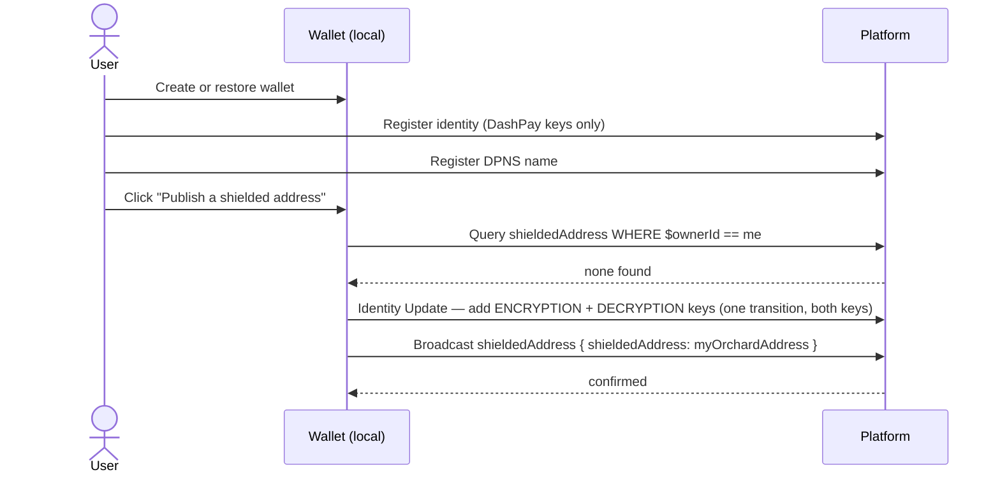
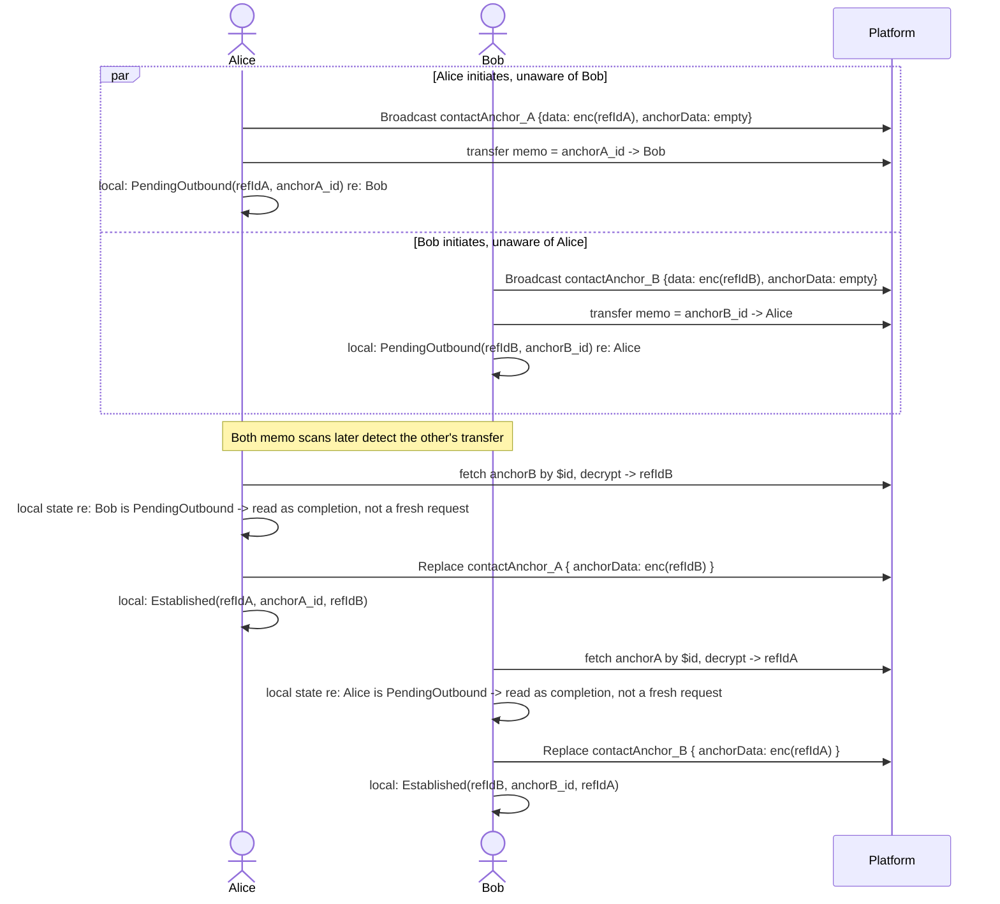
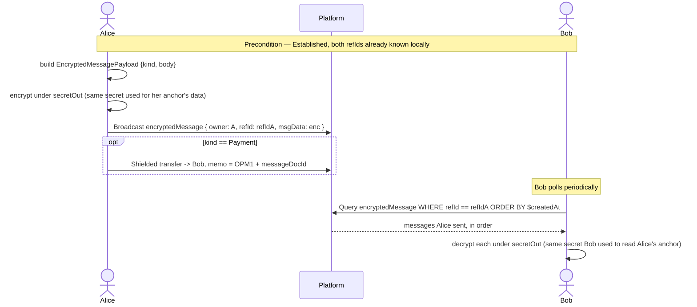
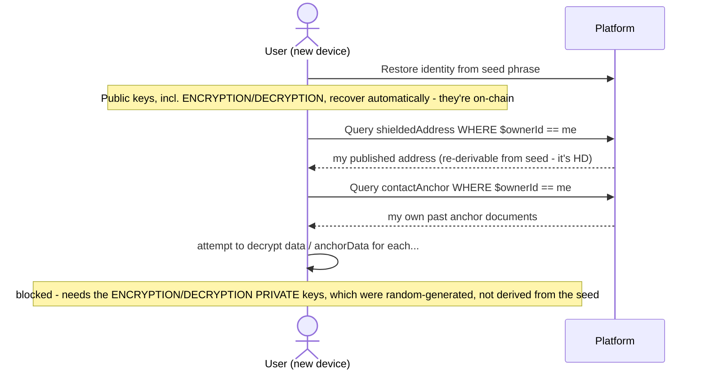

# OrchardPay — Query & Workflow Reference

Every document query the app issues against the OrchardPay contract, and the
six end-to-end flows that use them — what gets created, replaced, or fetched,
at each step.

Reflects the contract and code as of Milestone D (commit `0da85ed9`).
Milestones E and F sections below describe the design, not shipped behavior.

Also published as a styled artifact with the same content:
https://claude.ai/code/artifact/67efbd02-ff89-41cc-ad42-818ac194e171

## 1. Query catalog

Three document types, plus one query that isn't a document query at all
(identity keys). Grouped by document type, in the order a real conversation
touches them.

### `shieldedAddress` — one per identity, unique on owner

| Query | Matched on | Returns | Used by |
|---|---|---|---|
| Resolve a name to an address | `$ownerId == X` (index: `byOwner`, unique) | 0 or 1 document | Contact search, right after the DPNS lookup resolves a username to an identity ID |
| Check my own publish status | `$ownerId == me` (index: `byOwner`, unique) | 0 or 1 document | OrchardPay screen's readiness gate; also the create-vs-replace check before publishing |

That's the whole query surface for this type — the unique index means there's
never more than one row to reason about per identity.

### `contactAnchor` — one per relationship, per side

| Query | Matched on | Returns | Used by |
|---|---|---|---|
| List my own anchors | `$ownerId == me` (index: `byOwner`) | 0..N documents (sort by `$createdAt` client-side — the index doesn't carry it) | Recovery: "what relationships did I start or complete, before local state existed" |
| Fetch a specific anchor | `$id == docId` (primary key, no index needed) | Exactly 1 document, or none | Reading a counterparty's anchor after a memo names its document ID. Can be batched — `$id in [...]` — if a scan pass surfaces several IDs at once |
| Look up "my anchor with Bob" | — not possible — | n/a | Nothing. No field in the document names the counterparty, on purpose — see below |

**By design, not a gap.** There's no query for "give me my anchor for
counterparty X" — that's the entire privacy property this document type
exists to provide. The only way to know which anchor belongs to which
relationship is the local mapping the app keeps for itself (the wallet's k/v
sidecar, `orchardpay_get_contact_state`). Lose that mapping without already
knowing who your contacts were by some other means, and the anchors become
undecryptable — the *fact* that N anchors exist is recoverable via
`byOwner`, but *who each one is with* is not, unless you can supply the
counterparty's identity yourself and try that one ECDH pairing. There's no
broadcast search to fall back on.

### `encryptedMessage` — polymorphic, one refId per direction

| Query | Matched on | Returns | Used by |
|---|---|---|---|
| Read a contact's messages to me | `refId == theirRefId` (index: `byReferenceIdAndCreated`) | 0..N, ordered by `$createdAt` | Thread polling — `theirRefId` comes from my own anchor's `anchorData` |
| Recover my own sent messages | `$ownerId == me` (index: `byOwnerIdAndCreated`) | 0..N, ordered by `$createdAt` | Same recovery role as `contactAnchor`'s `byOwner` — not the normal thread-read path |

**On combining `refId` and `$ownerId`:** no, and it can't be added later
without a schema change. Checked directly against Drive's query validator: a
query's WHERE fields must all belong to *one* defined index. `refId` and
`$ownerId` sit in two separate indices with no field in common, so
`refId == X AND $ownerId == Y` in one request fails outright — Drive rejects
it as `WhereClauseOnNonIndexedProperty`, not "slow," *rejected*. Owner
filtering has to happen client-side after the fetch.

In practice that's fine, not a workaround: a forged message under someone
else's `refId` would fail AEAD decryption immediately, since it's not
encrypted under the shared secret. Decryption already authenticates the
sender. An extra `$ownerId` filter would only ever be a spam/efficiency
trim, never a security requirement.

### Identity keys — a different kind of query entirely

| Query | Matched on | Returns | Used by |
|---|---|---|---|
| Fetch a counterparty's bounds-verified key | `IdentitiesContractKeysQuery` (identity + contract + docType + purpose) | Current key of that purpose, or none | Every ECDH step — resolving who to encrypt to, or who a signal claims to be from |

Not a document query — a dedicated identity-keys RPC. Every result still
gets its `contract_bounds()` checked client-side before use; the query
itself only guarantees "a key Platform would register for this contract,"
not "the one true key," so the app never skips that check.

## 2. Workflow scenarios

Six flows, in the order a relationship actually goes through them. The
first four are shipped (Milestone D); the last two are shown as
designed — messaging lands in Milestone E, recovery in Milestone F — with
one real gap flagged where the current design falls short.

### 1 · Onboarding — Built

Wallet → identity → DPNS name → publish. OrchardPay's own keys are
deliberately *not* part of identity creation — they're generated the moment
they're actually needed, as one step of publishing.



- **Documents:** 1× `shieldedAddress` (create)
- **Other on-chain:** 1× Identity Update transition (2 keys, 1 tx)
- **Queries:** `shieldedAddress` by `$ownerId` (pre-check)

### 2 · Make contact — Built

Alice finds Bob and signals him. Nothing broadcasts a link between them —
the signal rides inside a shielded transfer's memo, not a document field.

```mermaid
sequenceDiagram
    actor A as Alice
    participant P as Platform

    A->>P: Query domain WHERE normalizedLabel startsWith "bob"
    P-->>A: bob.dash -> identity B
    A->>P: Query shieldedAddress WHERE $ownerId == B
    P-->>A: Bob's Orchard address
    A->>P: IdentitiesContractKeysQuery(B, DECRYPTION, contactAnchor)
    P-->>A: Bob's bounds-verified DECRYPTION key
    A->>A: ECDH(Alice.ENC_priv, Bob.DEC_pub) -> secretOut
    A->>A: generate refIdA; encrypt {refIdA} under secretOut
    A->>P: Broadcast contactAnchor { owner: A, data: enc, anchorData: empty }
    P-->>A: anchorA_id
    A->>P: Shielded transfer -> Bob's address, memo = OPA1 + anchorA_id
    A->>A: local: PendingOutbound{refIdA, anchorA_id} keyed by B
```

- **Documents:** 1× `contactAnchor` (create, Alice's)
- **Other on-chain:** 1× shielded transfer, memo-tagged
- **Queries:** DPNS domain search; `shieldedAddress` by owner; identity-keys query (Bob's DECRYPTION)

### 3 · Accept contact — Built

Two separate moments: detection (automatic, every sync pass) and acceptance
(one click). Bob's completed anchor needs no follow-up update — he already
knows Alice's reference ID by the time he creates it.

```mermaid
sequenceDiagram
    actor B as Bob
    participant P as Platform

    Note over B: DET-side memo scan, every shielded sync pass
    B->>P: sync_shielded_notes_stream under own IVK
    B->>B: try_decrypt_note_with_memo finds OPA1 + anchorA_id
    B->>P: Fetch contactAnchor WHERE $id == anchorA_id
    P-->>B: Alice's anchor (owner: A)
    B->>P: IdentitiesContractKeysQuery(A, ENCRYPTION, contactAnchor)
    P-->>B: Alice's bounds-verified ENCRYPTION key
    B->>B: ECDH(Bob.DEC_priv, Alice.ENC_pub) -> secretOut (mirrors Alice's)
    B->>B: decrypt data -> refIdA
    B->>B: no local state for A yet -> store PendingInboundUnaccepted{refIdA, anchorA_id}

    Note over B: User clicks Accept
    B->>P: IdentitiesContractKeysQuery(A, DECRYPTION, contactAnchor)
    P-->>B: Alice's bounds-verified DECRYPTION key
    B->>B: ECDH(Bob.ENC_priv, Alice.DEC_pub) -> secretIn (new, distinct value)
    B->>B: generate refIdB; encrypt refIdB -> data, encrypt refIdA -> anchorData (both under secretIn)
    B->>P: Broadcast contactAnchor { owner: B, data: enc(refIdB), anchorData: enc(refIdA) }
    P-->>B: anchorB_id
    B->>P: Shielded transfer -> Alice's address, memo = OPA1 + anchorB_id
    B->>B: local: Established{refIdB, anchorB_id, refIdA} keyed by A
```

- **Documents:** 1× `contactAnchor` fetched by ID (Alice's); 1× `contactAnchor` created, already complete (Bob's)
- **Other on-chain:** 1× shielded transfer, memo-tagged
- **Queries:** 2× identity-keys query (Alice's ENCRYPTION, then DECRYPTION)

### 4 · Contact at the same time — Built (emergent, not special-cased)

Alice and Bob each initiate toward the other before seeing the other's
signal. Nobody wrote code for this case — it falls out of the same state
machine as a normal accept, because "I was PendingOutbound to this signer"
reads the same regardless of who acted first.



**What's different here:** the normal flow does one `ReplaceDocument`
(Alice completes her own anchor after Bob's accept). Here, both sides run
that same completion step independently — two anchors, two replaces, no
coordination between them, and no race to resolve. Each side's anchor only
ever gets written by that side's own keys, so there's nothing to conflict.

### 5 · Create a message for a contact — Design only, Milestone E

Not implemented yet. Sending reuses the same per-relationship secret an
anchor already established — there's no new key derivation, and reading is
a poll, not a push.



- **Documents (planned):** 1× `encryptedMessage` per send
- **Other on-chain:** shielded transfer, only for `Payment`-kind messages
- **Queries (planned):** `encryptedMessage` by `refId`, polled

### 6 · Relaunch from a new wallet — Design only, Milestone F

Restoring an identity from a seed phrase alone, with no other local backup.
This is where the design has a real hole worth knowing about now, before
it's load-bearing.



**Real gap, not a hypothetical.** `ensure_own_orchardpay_keys` generates the
ENCRYPTION and DECRYPTION keypairs with a true RNG
(`KeyType::random_public_and_private_key_data`), the same way DashPay's own
contact keys are generated today — not derived from the wallet seed the way
the master/auth keys are. The *public* halves are safe; they're published
on-chain as part of the identity and come back on any restore. The
*private* halves only ever existed in this device's local vault.

Restore from seed phrase alone, with no separate vault/app-data backup, and
the identity comes back with a published `shieldedAddress` and a visible
list of past `contactAnchor` documents — but none of them decrypt. The
person is contactable again going forward (a fresh
`ensure_own_orchardpay_keys` call mints new keys the first time they
publish again), but every existing relationship and its history is
unreadable under the new keys. Worth deciding deliberately — HD-derive
these keys instead so a seed-only restore actually recovers them, or
document the limitation plainly before anyone relies on it.
